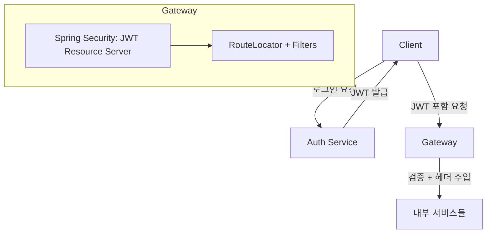

# 🛡️ Spring Cloud Gateway - JWT 기반 마이크로서비스 게이트웨이

Spring Boot 기반의 **Reactive Gateway 프로젝트**입니다.  
JWT 인증을 통해 사용자 정보를 헤더에 담아 전달하고, 서비스 간 책임을 분리하여 효율적인 마이크로서비스 아키텍처를 구성합니다.

---

## 📚 목차

- [🏗️ 인증/인가 시스템 구조](#-인증인가-시스템-구조)
    - [📌 아키텍처 요약](#-아키텍처-요약)
    - [🔄 인증 처리 흐름](#-인증-처리-흐름)
- [🤔 왜 Resource Server를 사용할까?](#-왜-resource-server를-사용할까)
- [📁 프로젝트 구조](#-프로젝트-구조)
- [🧩 클래스별 설명](#-클래스별-설명)
- [🧪 application.yml 예시](#-applicationyml-예시)
- [🚀 확장 가능 기능](#-확장-가능-기능)
- [📄 License](#-license)

## 🗂 아키텍처 다이어그램 (Mermaid)



## 🏗️ 인증/인가 시스템 구조

Apple 소셜 로그인 및 일반 회원가입/로그인을 모두 지원하며, 인증/인가는 Gateway에서 검증하고 내부 서비스는 사용자 정보를 헤더로 전달받아 비즈니스 로직을 수행합니다.

### 📌 아키텍처 요약

```
[Client]
   ↓ 로그인 요청 (Apple 또는 일반 로그인)

[Auth Service]
   → 로그인 처리
   → JWT (Access + Refresh) 발급

[Client]
   → 모든 요청에 JWT 포함 (Authorization: Bearer xxx)

[Gateway]
   → JWT 검증 (Spring Security + Resource Server)
   → user-id, role 등 헤더 주입

[내부 서비스]
   → 주입된 헤더 기반으로 비즈니스 로직 수행
```

---

## 🔄 인증 처리 흐름

```
[Client] 
  ↓ Authorization: Bearer {JWT}

1. [Netty 서버 수신]
   ↓
2. [Spring Security 필터 체인]
   → JWT 유효성 검사
   → 인증된 Principal 등록

3. [RouteLocator]
   → 요청 경로 기반 라우팅 대상 결정

4. [GatewayFilter (jwtClaimToHeaderFilter)]
   → Principal에서 user-id, role 추출 → Header로 주입

5. [내부 서비스 호출]
   → user-id, user-role 포함한 HTTP 요청 전달
```

---

물론입니다! 요청하신 내용을 바탕으로 기존 섹션 “왜 Resource Server를 사용할까?” 를 아래와 같이 확장된 내용으로 다시 작성해드립니다. 표, 장점 요약, 수동 구현의 단점까지 모두 포함되어 있어 README.md에 바로 넣어도 괜찮은 형태입니다.

⸻


## 🤔 왜 Resource Server를 사용할까?

Spring Security에는 JWT를 검증하는 두 가지 방식이 있습니다:

| 방식 | 설명 |
|------|------|
| ✅ `resource-server` | Spring이 내부적으로 JWT 파싱 및 서명 검증 수행 (RS256/HS256 등 지원). `JwtAuthenticationToken` 객체 자동 주입 |
| ❌ 수동 필터 구현 | 서명 검증, 토큰 파싱, Claim 추출을 직접 구현해야 하며 보안 실수 가능성 존재 |

---

### ✅ Resource Server 사용 장점

- 🔒 **보안 취약점 최소화**: 검증 로직을 직접 구현하지 않아 실수 위험이 적음
- 🔁 **키 교체(Key Rotation) 대응**: JWK 방식 또는 PEM 파일 변경만으로 처리 가능
- 🔧 **OIDC/OpenID 연동 용이**: Keycloak, Okta, Cognito와도 설정만으로 연동 가능
- 🧼 **설정만으로 간편 구성**:
  ```yaml
  spring:
    security:
      oauth2:
        resourceserver:
          jwt:
            public-key-location: classpath:public.pem

	•	📦 JWT 표준 Claim 자동 처리: exp, nbf, aud, iss 등의 검사 자동 포함
	•	🧪 테스트/모킹 쉬움: @WithMockJwt, SecurityContext 설정 없이 테스트 가능


### ⚠️ 수동 필터 구현의 단점

- 🧱 **직접 구현해야 하는 요소**
    - JWT 디코딩 (`Base64.decode`)
    - 서명 검증 (HMAC, RSA 등 알고리즘별 로직)
    - Claim 추출 및 유효성 검사

- 🔓 **보안 실수 가능성**
    - `alg=none` 취약점
    - 서명 미검증 문제
    - `exp`, `nbf`, `aud` 검사 누락 등

- 🧪 **테스트와 유지보수 어려움**
    - 테스트용 `SecurityContext`를 직접 구성해야 함
    - 인증 로직 변경 시 전체 서비스에 영향 → 재배포 위험 증가

⸻

✅ 결론

resource-server 방식은 “JWT 인증 책임을 Spring에게 위임”하고, 우리는 비즈니스 로직에 집중할 수 있는 구조입니다.
실무에서는 직접 필터를 만들기보다 공식 지원되는 보안 프레임워크에 책임을 맡기는 것이 더 안전하고 유지보수가 쉽습니다.

---

```yaml
spring:
  security:
    oauth2:
      resourceserver:
        jwt:
          public-key-location: classpath:public.pem
```

> 인증 서버에서 JWT를 발급하고, Gateway는 검증만 수행하는 구조에 매우 적합.

---

## 📁 프로젝트 구조

```
gateway
├── build.gradle
├── README.md
└── src
    └── main
        ├── java/com/leebak/gateway
        │   ├── GatewayApplication.java
        │   ├── config
        │   │   ├── CorsGlobalConfig.java
        │   │   ├── CustomAuthEntryPoint.java
        │   │   ├── GatewayRouteConfig.java
        │   │   ├── SecurityConfig.java
        │   │   └── ServiceRouteProperties.java
        │   └── filter
        │       ├── JwtHeaderFilter.java
        │       └── LoggingFilter.java
        └── resources
            ├── application.yml
            └── application-dev.yml
```

---

## 🧩 클래스별 설명

### ✅ `CorsGlobalConfig.java`

```code
@Configuration
public class CorsGlobalConfig {
    @Bean
    public WebFluxConfigurer corsConfigurer() {
        return registry -> registry.addMapping("/**")
            .allowedOrigins("*")
            .allowedMethods("GET", "POST", "PUT", "DELETE", "OPTIONS")
            .allowedHeaders("*")
            .allowCredentials(true);
    }
}
```

🔍 전역 CORS 허용 설정

---

### ✅ `CustomAuthEntryPoint.java`

```code
@Override
public Mono<Void> commence(ServerWebExchange exchange, AuthenticationException ex) {
    String message = resolveMessage(ex);
    ServerHttpResponse response = exchange.getResponse();
    response.setStatusCode(HttpStatus.UNAUTHORIZED);
    response.getHeaders().setContentType(MediaType.APPLICATION_JSON);

    String body = ApiResponse.errorJsonString(401, message);
    DataBuffer buffer = response.bufferFactory().wrap(body.getBytes(StandardCharsets.UTF_8));
    return response.writeWith(Mono.just(buffer));
}
```

🔍 인증 실패 시 JSON 포맷 응답 반환

---

### ✅ `GatewayRouteConfig.java`

```code
routes.route(routeDefinition.getId(), r -> 
    r.path(paths)
     .filters(f -> f.removeRequestHeader("Cookie")
                    .filter(jwtClaimToHeaderFilter))
     .uri(routeDefinition.getUri()));
```

🔍 라우팅 정의 기반 Gateway 라우트 구성

---

### ✅ `SecurityConfig.java`

```code
http.csrf().disable()
    .authorizeExchange()
    .pathMatchers(permitAllPaths).permitAll()
    .anyExchange().authenticated()
    .and()
    .oauth2ResourceServer()
    .jwt().authenticationEntryPoint(customAuthEntryPoint);
```

🔍 Spring Security + Resource Server 기반 JWT 인증 구성

---

### ✅ `ServiceRouteProperties.java`

```yaml
service:
  routes:
    permitAll:
      - id: auth
        paths: ["/auth/**"]
        uri: http://auth-service
    authenticated:
      - id: user
        paths: ["/user/**"]
        uri: http://user-service
```

🔍 application.yml 기반의 동적 라우팅 정보 바인딩

---

### ✅ `JwtHeaderFilter.java`

```code
if (principal instanceof JwtAuthenticationToken token) {
    Jwt jwt = token.getToken();
    String userId = jwt.getSubject();
    String role = jwt.getClaimAsString("role");

    ServerHttpRequest request = exchange.getRequest().mutate()
        .header("user-id", userId)
        .header("user-role", role != null ? role : "ROLE_USER")
        .build();

    return chain.filter(exchange.mutate().request(request).build());
}
```

🔍 JWT의 Claim을 내부 서비스로 전달하기 위한 Header 주입

---

### ✅ `LoggingFilter.java`

```code
String traceId = UUID.randomUUID().toString();

ServerHttpRequest mutatedRequest = exchange.getRequest()
    .mutate()
    .header("X-Trace-Id", traceId)
    .build();

exchange.getResponse().getHeaders().add("X-Trace-Id", traceId);
return chain.filter(exchange.mutate().request(mutatedRequest).build());
```

🔍 요청마다 고유 X-Trace-Id 부여 → 요청/응답 헤더 포함

---

## 🧪 application.yml 예시

```yaml
service:
  routes:
    permitAll:
      - id: auth
        paths: ["/auth/**"]
        uri: http://auth-service
    authenticated:
      - id: user
        paths: ["/user/**"]
        uri: http://user-service

spring:
  security:
    oauth2:
      resourceserver:
        jwt:
          public-key-location: classpath:public.pem
```

---

## 🚀 확장 가능 기능

- ✅ Swagger 인증 제외: `/swagger-ui/**`, `/v3/api-docs/**`
- ✅ Redis 기반 Rate Limiting 필터
- ✅ CircuitBreaker, Retry, LoadBalancer 적용
- ✅ gRPC 기반 마이크로서비스 통신 연동


---

## 🔍 참고 자료

- [Spring Cloud Gateway 공식 문서](https://docs.spring.io/spring-cloud-gateway/reference/)
- [Spring Security - Resource Server (JWT 검증)](https://docs.spring.io/spring-security/reference/servlet/oauth2/resource-server/jwt.html)
- [JwtAuthenticationToken 클래스 설명 (공식 API 문서)](https://docs.spring.io/spring-security/site/docs/current/api/org/springframework/security/oauth2/server/resource/authentication/JwtAuthenticationToken.html)
- [Spring Gateway에서 커스텀 필터 작성 가이드 (Baeldung)](https://www.baeldung.com/spring-cloud-custom-gateway-filters)
- [CORS 설정 in WebFlux 환경 (공식 API 문서)](https://docs.spring.io/spring-framework/reference/web/webflux-cors.html)
- [Spring Security 인증 예외 처리 가이드 (Baeldung)](https://www.baeldung.com/spring-security-exceptionhandler)
---

## 📄 License

MIT License © 2025 devljc
