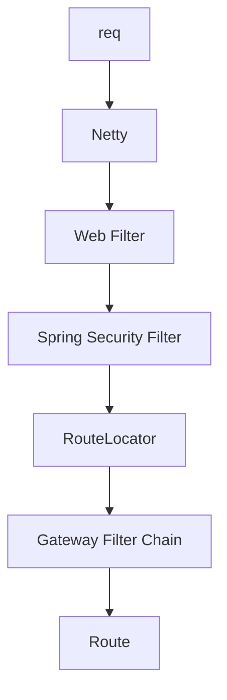
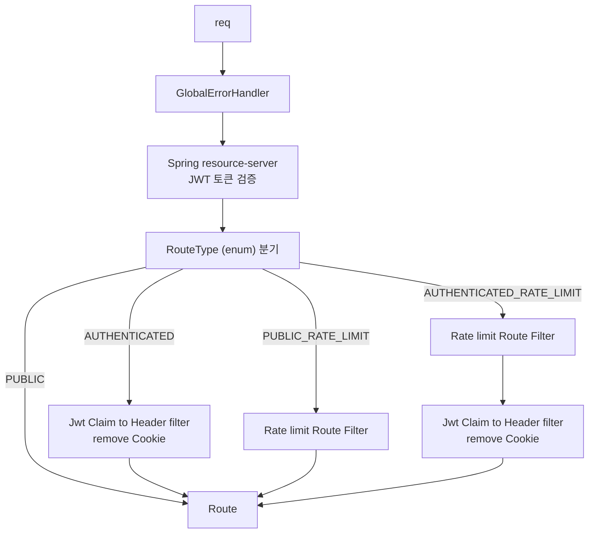

# 🛡️ Spring Cloud Gateway - JWT 기반 마이크로서비스 게이트웨이

Spring Boot 기반의 **Reactive Gateway 프로젝트**입니다.  
JWT 인증을 통해 사용자 정보를 헤더에 담아 전달하고, 서비스 간 책임을 분리하여 효율적인 마이크로서비스 아키텍처를 구성합니다.

---

## 📚 목차

- [🏗️ 인증/인가 시스템 구조](#-인증인가-시스템-구조)
  - [📌 아키텍처 요약](#-아키텍처-요약)
  - [🔄 인증 처리 흐름](#-인증-처리-흐름)
- [🤔 왜 Resource Server를 사용할까?](#-왜-resource-server를-사용할까)
- [📁 프로젝트 구조](#-프로젝트-구조)
- [🧩 클래스별 설명](#-클래스별-설명)
- [🧪 application.yml 예시](#-applicationyml-예시)
- [🚀 확장 가능 기능](#-확장-가능-기능)
- [📄 License](#-license)

### 🗂 Gateway Flow

#### 1. Gateway 요청 처리 순서 (Spring WebFlux 기반)


#### 2. RouteType 기반 Gateway 필터 처리 Flow

---
## 🏗️ 인증/인가 시스템 구조

Apple 소셜 로그인 및 일반 회원가입/로그인을 모두 지원하며, 인증/인가는 Gateway에서 검증하고 내부 서비스는 사용자 정보를 헤더로 전달받아 비즈니스 로직을 수행합니다.

### 📌 아키텍처 요약

```
[Client]
   ↓ 로그인 요청 (Apple 또는 일반 로그인)

[Auth Service]
   → 로그인 처리
   → JWT (Access + Refresh) 발급

[Client]
   → 모든 요청에 JWT 포함 (Authorization: Bearer xxx)

[Gateway]
   → JWT 검증 (Spring Security + Resource Server)
   → X-User-Id, X-User-Role 등 헤더 주입

[내부 서비스]
   → 주입된 헤더 기반으로 비즈니스 로직 수행
```

---

## 🔄 인증 처리 흐름

```
[Client] 
  ↓ Authorization: Bearer {JWT}

1. [Netty 서버 수신]
   ↓
2. [Spring Security 필터 체인]
   → JWT 유효성 검사
   → 인증된 Principal 등록

3. [RouteLocator]
   → 요청 경로 기반 라우팅 대상 결정

4. [GatewayFilter (jwtClaimToHeaderFilter)]
   → Principal에서 X-User-id, X-User-Role 추출 → Header로 주입

5. [내부 서비스 호출]
   → user-id, user-role 포함한 HTTP 요청 전달
```

---

## 🤔 왜 Resource Server를 사용할까?

Spring Security에는 JWT를 검증하는 두 가지 방식이 있습니다:

| 방식                  | 설명                                                                                    |
|---------------------|---------------------------------------------------------------------------------------|
| ✅ `resource-server` | Spring이 내부적으로 JWT 파싱 및 서명 검증 수행 (RS256/HS256 등 지원). `JwtAuthenticationToken` 객체 자동 주입 |
| ❌ 수동 필터 구현          | 서명 검증, 토큰 파싱, Claim 추출을 직접 구현해야 하며 보안 실수 가능성 존재                                       |

---

### ✅ Resource Server 사용 장점

- 🔒 **보안 취약점 최소화**: 검증 로직을 직접 구현하지 않아 실수 위험이 적음
- 🔁 **키 교체(Key Rotation) 대응**: JWK 방식 또는 PEM 파일 변경만으로 처리 가능
- 🔧 **OIDC/OpenID 연동 용이**: Keycloak, Okta, Cognito와도 설정만으로 연동 가능
- 🧼 **설정만으로 간편 구성**:
  ```yaml
  spring:
    security:
      oauth2:
        resourceserver:
          jwt:
            public-key-location: classpath:public.pem

	•	📦 JWT 표준 Claim 자동 처리: exp, nbf, aud, iss 등의 검사 자동 포함
	•	🧪 테스트/모킹 쉬움: @WithMockJwt, SecurityContext 설정 없이 테스트 가능

### ⚠️ 수동 필터 구현의 단점

- 🧱 **직접 구현해야 하는 요소**
    - JWT 디코딩 (`Base64.decode`)
    - 서명 검증 (HMAC, RSA 등 알고리즘별 로직)
    - Claim 추출 및 유효성 검사

- 🔓 **보안 실수 가능성**
    - `alg=none` 취약점
    - 서명 미검증 문제
    - `exp`, `nbf`, `aud` 검사 누락 등

- 🧪 **테스트와 유지보수 어려움**
    - 테스트용 `SecurityContext`를 직접 구성해야 함
    - 인증 로직 변경 시 전체 서비스에 영향 → 재배포 위험 증가

⸻

✅ 결론

resource-server 방식은 “JWT 인증 책임을 Spring에게 위임”하고, 우리는 비즈니스 로직에 집중할 수 있는 구조.
실무에서는 직접 필터를 만들기보다 공식 지원되는 보안 프레임워크에 책임을 맡기는 것이 더 안전하고 유지보수에 용이.

---

```yaml
spring:
  security:
    oauth2:
      resourceserver:
        jwt:
          jwk-set-uri: https://your-auth-domain.com/v1/auth/jwks
```

> 인증 서버에서 JWT를 발급하고, Gateway는 검증만 수행하는 구조에 매우 적합.

---

## 📁 프로젝트 구조

```
gateway/
├── build.gradle
├── settings.gradle
├── README.md
├── core/
│   └── ... (core-utils 모듈)
└── src/main/java/com/example/gateway
    ├── GatewayApplication.java
    ├── config
    │   ├── CorsGlobalConfig.java
    │   ├── SecurityConfig.java
    │   ├── RateLimitConfig.java
    │   ├── RedisConfig.java
    │   ├── route/
    │   │   └── RouteRegistryConfig.java
    │   └── properties/
    │       ├── RouteProperties.java
    │       └── RouteType.java
    ├── exception
    │   └── GlobalErrorHandler.java
    └── filter
        ├── JwtHeaderFilter.java
        └── LoggingFilter.java
```

---

## 🧩 클래스별 설명
### ✅ `RouteRegistryConfig.java`
-  라우팅 정의 기반 Gateway 라우트 구성
- `RouteLocator`를 사용하여 동적으로 라우팅 정보 등록
- `RouteProperties`를 통해 application.yml의 라우팅 정보 바인딩

```java
public enum RouteType {
  PUBLIC,
  AUTHENTICATED,
  PUBLIC_RATE_LIMIT,
  AUTHENTICATED_RATE_LIMIT,
}
```
---
### ✅ `GatewayRouteConfig.java`
- 라우팅 정의 yml 기반 동적 Gateway 라우트 설정 구성

---
### ✅ `ServiceRouteProperties.java`
- application.yml 기반의 동적 라우팅 정보 바인딩

---
### ✅ `RateLimitConfig.java`
- Redis 기반 Rate Limiting 필터 설정
- yml 설정 기반으로 동적으로 RedisRateLimiter 등록
- IP 키 기반 Rate Limiting

---
### ✅ `SecurityConfig.java`
- Spring Security + Resource Server 기반 JWT 인증 구성

---
### ✅ `CorsGlobalConfig.java`
- 전역 CORS 허용 설정

---
### ✅ `GlobalErrorHandler.java`
- ErrorWebExceptionHandler 구현 filter 맨 앞에 위치
🔍 예외 발생 시 응답 포맷 JSON으로 통일
---
### ✅ `JwtHeaderFilter.java`
- JWT의 Claim을 내부 서비스로 전달하기 위한 Header 주입
---
### ✅ `LoggingFilter.java`
- 요청마다 고유 X-Trace-Id 부여 → 요청/응답 헤더 포함

---

## 🧪 application.yml 예시

```yaml
service:
  routes:
    # The login-service is a microservice that handles user login.
    - id: login-service
      paths: [ /v1/login/**, /v1/logout/** ]
      uri: http://auth-service.app-server.svc.cluster.local
      type: PUBLIC

    # The auth-service is a microservice that handles authentication and authorization.
    - id: user-service
      paths: [ /v1/user/** ]
      uri: http://auth-service.app-server.svc.cluster.local
      type: AUTHENTICATED

    - id: auth-service
      paths: [ /v1/auth/** ]
      uri: http://auth-service.app-server.svc.cluster.local
      type: PUBLIC_RATE_LIMIT
      rate-limit:
        requestPerSecond: 10
        burst: 20
```

---

## 🚀 확장 가능 기능

- ✅ Swagger 인증 제외: `/swagger-ui/**`, `/v3/api-docs/**`
- ✅ Redis 기반 Rate Limiting 필터
- ✅ CircuitBreaker, Retry, LoadBalancer 적용
- ✅ gRPC 기반 마이크로서비스 통신 연동

---

## 🔍 참고 자료

- [Spring Cloud Gateway 공식 문서](https://docs.spring.io/spring-cloud-gateway/reference/)
- [Spring Security - Resource Server (JWT 검증)](https://docs.spring.io/spring-security/reference/servlet/oauth2/resource-server/jwt.html)
- [JwtAuthenticationToken 클래스 설명 (공식 API 문서)](https://docs.spring.io/spring-security/site/docs/current/api/org/springframework/security/oauth2/server/resource/authentication/JwtAuthenticationToken.html)
- [Spring Gateway에서 커스텀 필터 작성 가이드 (Baeldung)](https://www.baeldung.com/spring-cloud-custom-gateway-filters)
- [CORS 설정 in WebFlux 환경 (공식 API 문서)](https://docs.spring.io/spring-framework/reference/web/webflux-cors.html)
- [Spring Security 인증 예외 처리 가이드 (Baeldung)](https://www.baeldung.com/spring-security-exceptionhandler)
- [Spring Cloud Gateway - RequestRateLimiter 필터 설명](https://docs.spring.io/spring-cloud-gateway/reference/spring-cloud-gateway/gatewayfilter-factories/requestratelimiter-factory.html)
- [Spring.io 블로그 - API Rate Limiting with Spring Cloud Gateway](https://spring.io/blog/2021/04/05/api-rate-limiting-with-spring-cloud-gateway)
---

## 📄 License

MIT License © 2025 devljc
